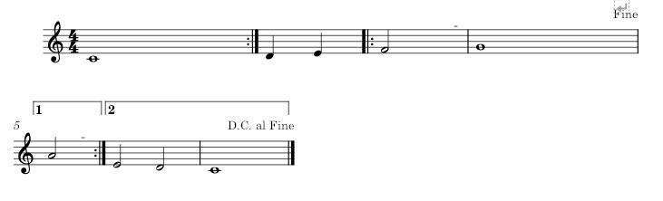

---
# Title, summary, and page position.
linktitle: Repetition Handling
summary: Learn how Partitura and the Match Format handles repetitions during the performance's score unfolding.
weight: 2

# Page metadata.
title: Repetition Handling
type: book  # Do not modify.
---

### TODO: this page is just a proposal for rep handling in partitura and a PR, update and move!


## Repetition Handling

### Some background

Currently the repeat object is a simple *TimedObject* with start and end time.

Repeat objects are read from xml barline objects with repeat and Volta brackets are read from barline objects with "ending" property in `partitura.score.Ending` obejects and have a number property.

This allows for the creation of *ScoreVariants* based on *Repeats* for the unfolding of parts.

There are several limit cases to unfolding/segmentation:

- the endpoint of Ending objects (encoding a Volta bracket) is not automatically inferred
- Volta brackets with >2 endings are not supported
- Nested repeats are not supported
- all other navigation marks (segno, coda, capo, fine, ...?) are not supported

The *ScoreVariant* itself allows for segment-type/jump-type-agnostic *ScoreVariants*. As far as I understand the ScoreVariant contains a segment list of the structure:

```
sv.segments = [(0,6,0),(0,6,6)(6,10,12)]
```

where the three numbers mean (start of segment, end of segment, cumulative/unfolded start of segment)

see this example by Francesco:



where the possible omissions of repeats lead to these four segment lists:

```
[(0, 4, 0), (4, 6, 4), (6, 12, 6), (14, 22, 12)] [(0, 4, 0), (4, 6, 4), (6, 14, 6), (6, 12, 14), (14, 22, 20)] [(0, 4, 0), (0, 4, 4), (4, 6, 8), (6, 12, 10), (14, 22, 16)] [(0, 4, 0), (0, 4, 4), (4, 6, 8), (6, 14, 10), (6, 12, 18), (14, 22, 24)]
```

These segments and the corresponding ScoreVariants are created from the Repeat objects. As you can see the da capo and fine are ignored. but segments can also be added to a ScoreVariant, they are just defined by positions.

## my proposal for a Segment object

I think these problems of unfolding could be solved with a partitura.score.Segment object:

```
class Segment(TimedObject):    """Class that represents any segment between two navigation markers     Parameters    ----------    id : int/string        The ID associated with this segment    jump_to : list of int/string        The IDs of segments where the unfolded score could jump to at the end of this segment     Attributes    ----------    id : int/string        See parameters    jump_to : list of int/string        See parameters    jump_id : int        the id     """     def __init__(self, id, jump_to):        super().__init__()        self.id = id        self.jump_to = jump_to        self.jump_id = 0 
```

Let's go back to the score example above. This part would contain 5 segments:

- the first 4 beats, let's call it a
- the beats 4 - 6 : b
- 6 - 12 : c
- 12 - 14 : d
- 14 - 22 : e

and their jump_to properties would look like this:

```
a.jump_to = ["a", "b"] b.jump_to = ["c"] c.jump_to = ["d", "e", end] d.jump_to = ["c"] e.jump_to = ["a", end] # since it would be an option to not play the da capo?
```


# PR

# General Score Unfolding Overhaul

This PR contains the following new things in partitura.score.py:

* ```class Segment(TimedObject)```: a segment of a part between two time points that are relevant to the repetition structure
  - ```add_segments(part)```: a function adding segments to a part based on existing TimedObjects: Repeat, Ending, DaCapo, DalSegno, Segno, AlCoda, Coda, Fine
  - ```get_segments(part)```: returns a dict of segments indexed by segment ID
  - ```pretty_segments(part)```: creates a pretty string describing the segments of a part


* ```class Path```: a Path object encodes a sequence of segments and utility needed to extend that sequence, if it hasn't reached an end of the part.
  - ```unfold_paths(*args)```: recursively unfold and multiply a Path into all possible Paths and store these in a list
  - ```get_paths(part, *args)```: call unfold_paths with the starting segment Path and return the resulting paths as parametrized (for options, see below)
  - ```new_part_from_path(*args)```: create a new part from a Path
  - ```new_scorevariant_from_path(*args)```: create a new ScoreVariant from a Path

* Updated functions from which now use the new unfolding:
  - ```iter_unfolded_parts(*args)```: iterator over all unfolded parts
  - ```unfolded_part_maximal(*args)```: returns the longest unfolded part
  - ```unfolded_part_alignment(*args)```: returns the unfolded part that best fits the note IDs in an alignment
  - ```make_score_variants(*args)```: creates a list of ScoreVariant objects

## Why?

Theses changes solve limit cases of unfolding/segmentation:
- Volta brackets with >2 endings are supported
- Nested repeats are supported
- Other navigation marks (segno, coda, capo, fine) are supported

Additionally, the changes make the following possible:
* get all unfoldings with some specific constraints:
  - all!
  - the longest!
  - the longest without repeats after a jump mark (dal segno, al cado, da capo)
  - all without repeats after a jump mark (dal segno, al cado, da capo)
  - the shortest
* create any unfolding:
  - pick any segment(s) you like from the list of segments (```print(partitura.score.pretty_segments(part))``` for an overview) 
  - add them to a path ```p = Path(["C","K","&",...], segments)```
  - create a new part from this path ```new_part = new_part_from_path(p, part)```
* get informative strings about segments and paths:
  - as above: ```print(partitura.score.pretty_segments(part))```  
  - for paths use ```print(path)``` or ```print(path.pretty())```  

## How?

The Segments add information about the structure and the possible jumps from every segment to the part. 
The Path parses this tree of possible unfoldings (with constraints, if desired).
The ScoreVariant creates a variant of the score based on the list of of segment IDs stored (or possibly computed) in a Path.

## Other Bits and Fixes:

- ```load_musicxml```: correct parsing of location attribute of barline tag
- ```load_musicxml```: correct parsing of navigation markers (Da Capo, Al Segno, Segno, Al Coda, Coda, Fine)
- ```score.py```: TimedObject subclasses for navigation markers
- ```ScoreVariant.create_variant_part()```: Ignore the following score elements for the new part: Repeat, Ending, ToCoda, DaCapo, DalSegno, Segment, Page, System
- ```ScoreVariant.create_variant_part()```: Check for previous clefs before adding new clef element
- modified the unfolding unittest and added a new more complex test for unfolding with jumps and three Volta brackets
- added ```part.measure_number_map```here
- added test for ```part.measure_number_map```
- marked five functions as DEPRECATED (TODO: remove before merge)
